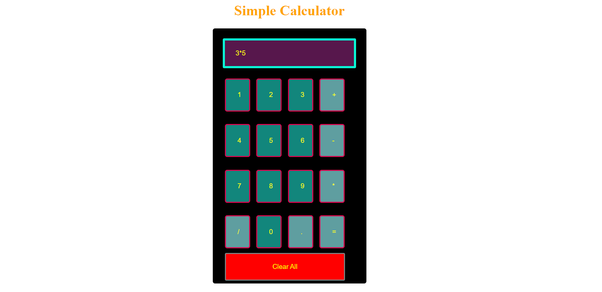

<h1>Simple_Calculator</h1>
<pre>
<strong>Use of HTML</strong>
In this program, we are using HTML to create content for the calculator UI; that means we are creating boxes, input fields, buttons, etc.

<strong>Use of CSS</strong>
We are using CSS for managing the content of HTML like the content color, width, height, font size, padding, margin, etc.
<strong>Use of JavaScript</strong>
In a calculator, it is established that there are different buttons and all these buttons have different functions. For example, the + button performs the addition operation, and – performs the subtraction, and it is possible to assign these operations to these buttons using JavaScript.img.
</pre>

